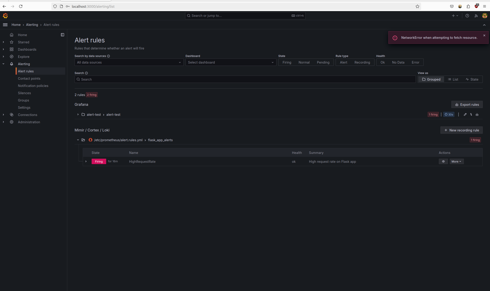

```markdown
# Monitoring and Dashboard Setup with Prometheus and Grafana

This repository demonstrates how to set up monitoring for a simple web application using Prometheus and Grafana. Prometheus is used to scrape metrics from the application, and Grafana is used to visualize these metrics on a dashboard.

## Components

- **Flask Web Application**: A simple Python Flask application containerized with Docker.
- **Prometheus**: A monitoring and alerting toolkit, which scrapes metrics from our Flask app.
- **Grafana**: A platform for analytics and monitoring, which visualizes Prometheus metrics on dashboards.

## Setup

### Prerequisites

- Docker
- Docker Compose

### Getting Started

1. **Clone this repository:**

   ```bash
   git clone <repository-url>
   cd <repository-directory>
   ```

2. **Build and run the Docker containers:**

   ```bash
   docker-compose up --build -d
   ```

   This command will build and start the Flask app, Prometheus, Grafana, and other required services.

3. **Access the following services:**

   - Flask App: [http://localhost:5000](http://localhost:5000)
   - Prometheus: [http://localhost:9090](http://localhost:9090)
   - Grafana: [http://localhost:3000](http://localhost:3000) (login with username `admin` and password `admin`)

## Monitoring Setup

### Prometheus Configuration

Prometheus is configured to scrape metrics from the Flask application using the `/metrics` endpoint. The `prometheus.yml` configuration file defines the scrape target and interval.

**prometheus/prometheus.yml:**
```yaml
global:
  scrape_interval: 15s

scrape_configs:
  - job_name: 'flask_app'
    static_configs:
      - targets: ['flask_app:5000']
```

### Metrics

The Flask application exposes metrics such as request count (`request_count`) using the Prometheus Python client (`prometheus_client`).

**app/app.py:**
```python
from prometheus_client import Counter, generate_latest, CONTENT_TYPE_LATEST

app = Flask(__name__)

REQUEST_COUNT = Counter('request_count', 'App Request Count', ['method', 'endpoint'])

@app.route('/metrics')
def metrics():
    return generate_latest(), 200, {'Content-Type': CONTENT_TYPE_LATEST}
```

## Creating Grafana Dashboards

### Dashboard Setup

1. **Log in to Grafana** at [http://localhost:3000](http://localhost:3000).
2. **Navigate to** **Configuration > Data Sources** and add Prometheus as a data source with URL `http://prometheus:9090`.

### CPU Usage Dashboard Panel

1. **Create a new dashboard** and add a panel for CPU usage using the following PromQL query:

   ```promql
    rate(process_cpu_seconds_total[1m])
   ```

### Memory Usage Dashboard Panel

1. **Create another panel** for memory usage using the following PromQL query:

   ```promql
   process_resident_memory_bytes
   ```

### Total Count Dashboard Panel

1. **Create a panel** for total count (request count) using the following PromQL query:

   ```promql
   request_count_total
   ```

2. **Customize the dashboard layout**, titles, and axis labels as needed.

## Further Customization

- Modify Prometheus alerting rules (`alert.rules.yml`) for setting up alerts based on metrics thresholds.
- Explore additional Grafana features like templating, annotations, and more advanced visualizations.



<iframe width="560" height="315" src="https://youtu.be/1PwUA86v0kI?si=F8Lp7LpsVsgtbr3z" frameborder="0" allowfullscreen></iframe>


## Troubleshooting

- If metrics are not appearing in Prometheus, check the Flask app logs and Prometheus configuration for errors.
- Ensure Docker containers are running and accessible on the specified ports.
```

Dokumen ini memberikan panduan lengkap mulai dari setup monitoring dengan Prometheus dan Grafana, konfigurasi scrape log, hingga pembuatan dashboard untuk memantau CPU, memory usage, dan total count dari aplikasi Flask. Anda dapat menyesuaikan informasi ini sesuai dengan proyek dan lingkungan Anda.